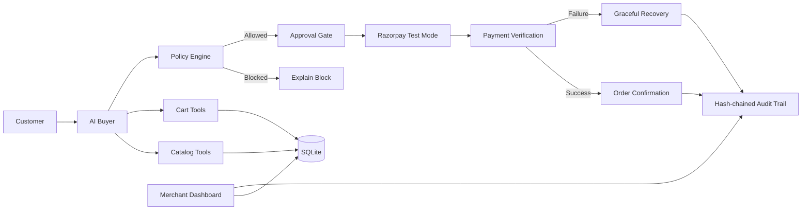

# ⚡ RazorFlow AI

### The AI Buyer that can safely transact.

**Discover → Recommend → Upsell → Approve → Pay**

[](backend/tests)
[](frontend/src)
[](frontend/src)
[](LICENSE)
[](https://razorpay.com/docs/payments/test-mode/)

RazorFlow AI is an AI-native commerce system that lets an AI buyer understand a merchant's catalog, recommend products, intelligently upsell relevant items, and complete a Razorpay-powered transaction — while keeping every financial action explainable, bounded, and gated.

🎬 **Watch the demo:** https://youtu.be/wim7gSKLrIA

<!-- DEMO VIDEO SPACE: to embed a local recording instead of (or next to)
     the YouTube link above, drop the file at docs/demo.gif (or docs/demo.mp4)
     and replace this comment with:  -->

## 🚀 What is RazorFlow AI?

AI can already tell you what to buy.

The missing step is:

**Can an AI agent safely go from a customer's intent to an actual transaction?**

RazorFlow AI closes that gap.

A customer can simply say:

> "I need running shoes for marathon training under ₹5,000."

The AI:

- Understands the customer's intent
- Searches an AI-readable merchant catalog
- Compares available products
- Recommends the best match
- Suggests a relevant upsell
- Builds the cart
- Checks the spending policy
- Explains the purchase
- Gets explicit user approval
- Opens Razorpay Test Mode checkout
- Verifies the payment
- Confirms the order
- Records the complete audit trail

The merchant gets both a new AI sales channel and measurable visibility into the revenue generated through it.

## 🎯 The Problem

Traditional ecommerce assumes a human is responsible for almost every step:

```text
Search
  ↓
Compare
  ↓
Choose
  ↓
Add to cart
  ↓
Checkout
  ↓
Pay
```

AI can now handle discovery and recommendation, but most AI shopping experiences stop before the actual transaction.

That creates a gap between **AI can recommend** and **AI can safely transact**.

RazorFlow AI is designed to close that loop.

## 💡 Our Solution

RazorFlow AI treats the AI not as a chatbot, but as a controlled commerce agent.

```text
Customer Intent
      ↓
AI Buyer
      ↓
AI-Readable Catalog
      ↓
Product Recommendation
      ↓
Upsell / Cross-sell
      ↓
Cart
      ↓
Policy Engine
      ↓
User Approval
      ↓
Razorpay Test Mode
      ↓
Payment Verification
      ↓
Order Confirmation
      ↓
Audit Trail
      ↓
Merchant Analytics
```

## ✨ Core Features

### 🤖 AI Buyer

Customers interact with the merchant using natural language. Examples:

- "I need running shoes under ₹5,000."
- "Something lightweight for a beginner."
- "Show me something cheaper."
- "Add the socks too."
- "Remove the socks."

The agent understands the request and interacts with the commerce system using structured tools.

### 🧠 Agent-Readable Catalog

Merchant products are represented as structured data that an AI agent can reliably query (15 seeded running-shoe catalog, variants with per-size stock, explicit + tag-based product relations).

The agent does not receive the entire database in its prompt. Instead, it uses catalog tools such as:

```text
search_products()
get_product()
check_stock()
get_related_products()
```

This makes the merchant's catalog directly consumable by an AI buyer.

### 🔎 Natural-Language Product Discovery

Customers don't need to know product IDs, filters, or catalog terminology. For example:

Customer: *"I need something for marathon training under ₹5,000."*

The agent turns this into structured intent such as:

```text
Category: Running Shoes
Use case: Marathon
Budget: ₹5,000
```

and searches the merchant catalog.

### 🎯 Explainable Product Recommendations

Recommendations are grounded in actual catalog data. Example:

> **Recommended: RunPro Sprint — ₹4,499**
> It matches your marathon-running requirement, is currently in stock, and stays ₹501 below your ₹5,000 budget.

The AI does not invent prices, stock, discounts, or product specifications.

### 📈 AI Upsell & Cross-sell

After selecting a primary product, the AI checks relevant complementary products. Example:

```text
RunPro Sprint       ₹4,499
Running Socks         ₹499
─────────────────────────
Final Total          ₹4,998
```

> "Would you like matching running socks for ₹499? They're a relevant accessory for your selected shoes."

The customer explicitly accepts or rejects the offer. A declined upsell is not repeatedly pushed. We track upsell offers, upsell acceptance, and incremental (live-only) revenue.

### 🛒 Conversational Cart

The cart can be controlled using natural language. Examples:

- "Add two pairs of socks."
- "Remove the socks."
- "Change the quantity to two."
- "What's my total?"

All cart totals are recalculated by the backend from trusted product data — no LLM math near money.

### 🔐 Explainable, Bounded, Gated

This is the core safety model of RazorFlow AI.

**Explainable.** Before payment, the customer sees products, quantity, price, final total, why the product was recommended, why an upsell was suggested, spending limit, policy result, and approval requirement.

**Bounded.** The AI operates within a deterministic commerce policy. Example:

```text
Maximum transaction: ₹5,000
Maximum quantity: 5
Upsells: Enabled
Maximum upsell: ₹2,000
Automatic retry: Disabled
```

If the cart exceeds the allowed amount:

```text
❌ PURCHASE BLOCKED

Cart total: ₹8,998
Transaction limit: ₹5,000

The transaction cannot proceed under the current policy.
```

The AI cannot bypass this restriction.

**Gated.** The AI cannot independently spend money. Before payment:

```text
┌────────────────────────────────────┐
│       PAYMENT AUTHORIZATION        │
│                                    │
│ RunPro Sprint             ₹4,499  │
│ Running Socks               ₹499  │
│                                    │
│ TOTAL                     ₹4,998  │
│                                    │
│ Policy limit              ₹5,000  │
│ Policy check                   ✓  │
│                                    │
│ [ APPROVE PAYMENT — ₹4,998 ]      │
└────────────────────────────────────┘
```

The user must explicitly approve the transaction. The backend records the actual approval via single-use tokens. The LLM can never set an approval flag itself.

### 💳 Razorpay Test Mode

After explicit approval:

```text
User Approval
      ↓
Backend Policy Check
      ↓
Razorpay Order Creation
      ↓
Razorpay Test Checkout
      ↓
Payment
      ↓
Server Verification
      ↓
Order Confirmation
```

The trusted payment amount is calculated server-side. Razorpay credentials remain server-side. Payment state is verified before the order is considered paid. Signed webhooks (plus browser failure reporting and a 30s status poll) keep payment state synchronized and idempotent.

### 🚨 Graceful Failure Handling

Agentic systems need to handle failure safely. RazorFlow AI deliberately demonstrates a failed payment scenario:

```text
Payment Started
      ↓
❌ Payment Failed
      ↓
Recovery State
```

The customer sees: *"Payment wasn't completed. No order was confirmed and no additional charge was attempted."* Available actions: **Retry Payment** (same approval, fresh Razorpay order — a double charge is structurally impossible) or return to cart. The system never creates a false successful order, silently retries indefinitely, loses the cart, or claims the payment succeeded. The failure is written to the audit trail.

### 🧾 Full Audit Trail

Every important action is recorded:

```text
USER_INTENT_RECEIVED   "Running shoes for marathon under ₹5,000"
SEARCH_PERFORMED       4 products found
PRODUCT_RECOMMENDED    RunPro Sprint — ₹4,499 (with reason)
UPSELL_OFFERED         Running Socks — ₹499 (with reason)
UPSELL_ACCEPTED
POLICY_CHECK           ₹4,998 ≤ ₹5,000
PAYMENT_APPROVAL_REQUESTED
PAYMENT_APPROVED       (actor: customer)
RAZORPAY_ORDER_CREATED
PAYMENT_SUCCESS
ORDER_CONFIRMED
```

The audit trail answers: what did the agent do, why did it do it, what was allowed, what did the user approve, and what happened to the payment. Events are SHA-256 hash-chained and the chain is recomputed live (`GET /api/audit/verify`); every row carries What / Why / Amount / Actor / Policy-hash columns.

### 🏪 Merchant Dashboard

The merchant gets visibility into the AI-powered sales channel: total and live-only revenue, AI conversion over tracked sessions, live upsell revenue and its share of live revenue, With-AI-vs-Without-AI diff, recent transactions (amber `HIST-`/`DEMO-` chips for synthetic rows, emerald `RF-` for live ones), and the audit ledger with a chain-intact badge.

> **Demo data never masquerades as live revenue.**
> - `RF-*` → live buyer purchases (real test-mode payments)
> - `HIST-*` → seeded demo history · `DEMO-*` → scripted triggers
> - Live metrics are calculated only from actual paid orders

## 🏗️ Architecture



## 🧠 Agent Architecture

The LLM is the reasoning layer — not the source of financial truth.

```text
                 ┌──────────────┐
                 │     LLM      │
                 │              │
                 │ Understand   │
                 │ Reason       │
                 │ Select tools │
                 └──────┬───────┘
                        ↓
                  Tool Registry
                  (9 tools)
                        ↓
        ┌───────────────┼────────────────┐
        ↓               ↓                ↓
     Catalog          Cart          Checkout intent
   (search,         (create,         (initiate,
    product,        add, update,       approval only)
    stock,          remove)
    related)
        │               │                │
        └───────────────┼────────────────┘
                        ↓
                  Policy Engine
                  (deterministic)
                        ↓
                 Approval Gate
                 (human + token)
                        ↓
                Razorpay Service
                        ↓
               Payment Verification
```

The LLM cannot directly modify the database, bypass policy, change spending limits, mark a payment successful, execute payment without approval, or invent catalog information.

## 🛡️ Security Principles

RazorFlow AI treats the browser and the LLM as untrusted for financial state.

- All trusted totals are calculated server-side; money is stored as integer paise
- Razorpay secrets never reach the frontend
- Payment and webhook signatures are verified server-side; duplicates handled idempotently
- Approval comes from an actual user action via single-use, constant-time-compared tokens
- Session mismatches are rejected; money routes are rate-limited (120/min/IP)
- SQLite foreign keys enforced; startup orphan purge; raw backend exceptions are not exposed to customers

## 🧰 Tech Stack

| Layer     | Technology                              |
|-----------|-----------------------------------------|
| Frontend  | Next.js 16 + React 19 + TypeScript      |
| UI        | Tailwind CSS 4 + shadcn/ui + Lucide     |
| Backend   | Python 3.12 + FastAPI + Pydantic        |
| Database  | SQLite + SQLAlchemy                     |
| AI        | Groq `qwen/qwen3.6-27b` (5-key rotation), Ollama + Gemini supported |
| Payments  | Razorpay Test Mode (orders API + checkout.js + webhooks) |
| Testing   | Pytest (181 tests) + eslint + `next build` |

## 📁 Project Structure

```text
RazorFlow-AI/
│
├── backend/
│   ├── models/        # 13 SQLAlchemy models
│   ├── schemas/       # Pydantic contracts
│   ├── routers/       # 10 routers: catalog, cart, agent, checkout,
│   │                  #   payment, policy, audit, dashboard, demo, well-known
│   ├── services/      # Business logic + ai/ (agent, tools, LLM clients)
│   ├── tests/         # 10 files, 181 pytest tests
│   ├── init_db.py     # DB creation + 15-product catalog seed
│   ├── seed_demo_history.py
│   └── main.py
│
├── frontend/
│   ├── src/app/       # Pages: landing, buyer, merchant, setup
│   ├── src/components/# chat, commerce, audit, merchant
│   ├── src/lib/       # API client, types, IST time helpers
│   └── public/products/  # 15 product photos
│
├── docs/              # architecture, api-contract, policy-spec, state-machine…
├── .env.example
├── README.md
└── .gitignore
```

## ⚡ Quick Start

### 1. Clone

```bash
git clone https://github.com/tisha-varma/RazorFlow-AI.git
cd RazorFlow-AI
```

### 2. Backend

```bash
cd backend
python -m venv venv
```

Windows:

```bash
venv\Scripts\activate
```

macOS / Linux:

```bash
source venv/bin/activate
```

Install dependencies:

```bash
pip install -r requirements.txt
```

### 3. Environment Variables

```bash
cp .env.example .env
```

Configure:

```env
LLM_PROVIDER=groq
LLM_API_KEYS=key1,key2,key3
LLM_MODEL=qwen/qwen3.6-27b

RAZORPAY_KEY_ID=
RAZORPAY_KEY_SECRET=
RAZORPAY_WEBHOOK_SECRET=
```

Razorpay credentials must be Test Mode credentials. Never commit `.env`.

### 4. Initialize Database

```bash
$env:PYTHONPATH = "C:\projects\RazorFLow AI"   # Windows PowerShell (project root)
backend\venv\Scripts\python.exe backend\init_db.py
```

This seeds the demo merchant, policy, 15-product catalog, and relationships.

### 5. Run Backend

```bash
backend\venv\Scripts\python.exe -m uvicorn backend.main:app --reload --port 8000
```

> Exactly one worker (the default) — state gating is per-process.

API documentation: http://localhost:8000/docs

### 6. Run Frontend

```bash
cd frontend
npm install
npm run dev
```

Open: http://localhost:3000 → **Start buying with AI**

Buyer: `http://localhost:3000/buyer` · Merchant: `http://localhost:3000/merchant`

## 🧪 Testing

```bash
cd backend
$env:PYTHONPATH = "C:\projects\RazorFLow AI"   # Windows PowerShell (project root)
.\venv\Scripts\python.exe -m pytest tests/ -q
```

181 tests covering: catalog search, cart calculations, policy boundaries, approval replay protection, stale amounts, payment verification and failure, duplicate webhook handling, retry without double charge, audit-chain verification, demo/live revenue separation, reset preservation, LLM fallback behavior, and agent tools — plus an end-to-end checkout chain.

```bash
cd frontend
npm run lint    # 0 errors, 0 warnings
npm run build   # offline-safe production build
```

## 🎬 Demo

### Scenario 1 — Successful AI Purchase

Customer: *"I need running shoes for a marathon under ₹5,000."*

The agent understands the request → searches catalog → recommends RunPro Sprint (₹4,499) → offers Running Socks (₹499) → customer accepts → cart ₹4,998 → policy passes → customer approves → Razorpay Test Checkout (card `4100 2800 0000 1007`) → payment verified → order confirmed → audit trail → merchant revenue updated.

### Scenario 2 — Payment Failure

Request → selection → upsell → policy → approval → Razorpay → ❌ payment failure (card `4100 2800 0006 0003`, or the in-buyer **Simulate decline**) → safe recovery card → **Retry payment** on the same approval → audit trail records both attempts.

## ⚙️ Commerce Policy

Default configuration (editable in-buyer or at `/setup`):

| Policy                  | Value      |
|-------------------------|------------|
| Maximum transaction     | ₹5,000     |
| Minimum transaction     | ₹0 (none)  |
| Approval required       | Yes (locked) |
| Maximum quantity        | 5          |
| Upsells                 | Enabled    |
| Maximum upsell          | ₹2,000     |
| Automatic payment retry | Disabled   |
| Session spending limit  | ₹10,000    |

Policies live in the database and are enforced by backend code. Changing one logs a `POLICY_CHANGED` audit event, and every approval freezes the limits in force into its snapshot.

## 🧭 State Machine

```text
IDLE → DISCOVERING → RECOMMENDING → CART_BUILDING → UPSELLING
  → POLICY_CHECK → AWAITING_APPROVAL → PAYMENT_PENDING
  → PAYMENT_SUCCESS → ORDER_CONFIRMED
```

(`PAYMENT_FAILED` loops back to `PAYMENT_PENDING` for retry; invalid transitions return 409.)

## 📌 Why This Is Different

RazorFlow AI is not trying to be another shopping chatbot. The core idea is to **move AI from recommendation to safe transaction execution**: the AI handles intent → discovery → recommendation → upsell, while the controlled backend handles policy → approval → payment → verification → order. That separation makes agentic commerce practical and trustworthy.

## 🧪 Demo Data

The project uses synthetic/demo data for hackathon demonstration: demo merchant, policy, product catalog and relationships, orders, and sessions. Rows are labeled (`HIST-*` seeded history, `DEMO-*` scripted triggers, `RF-*` live test-mode purchases) and live metrics never blend them. No real customer payment credentials or personal data are required.

## 🗺️ Roadmap

- Multi-merchant shopping + per-merchant keys
- Real user auth (sessions are currently client UUIDs)
- PostgreSQL + versioned migrations, Redis-backed state
- Live Razorpay keys, refunds, settlements
- Order tracking, receipts, voice-based commerce
- Standardized agent-commerce protocols

## 🚧 Known Limitations

- Payments use Razorpay Test Mode; deployment surface is demo-grade (single merchant, single worker, SQLite, no auth) while the safety model is production-shaped.
- Metrics are honest at small scale: derived baselines, tracked-session conversion, labeled synthetic rows — not statistically powered.

## 🏆 Built For

**Razorpay Buildathon — Track 01, AI Growth & Agentic Commerce.** Grow the merchant's revenue, and make them sellable to AI buyers: AI-native discovery, revenue-generating upsells, safe agentic transactions.

## 👩‍💻 Author

**Tisha Varma** — GitHub: [@tisha-varma](https://github.com/tisha-varma) — Project: [RazorFlow-AI](https://github.com/tisha-varma/RazorFlow-AI)

⭐ If you find the project interesting, star the repository and follow it as it evolves toward AI-native commerce.
