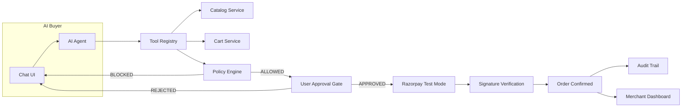

# RazorFlow AI

**An AI buyer that can safely transact with a merchant.**

> Built for the Razorpay AI Growth & Agentic Commerce hackathon track.

Every money action is **explainable**, **bounded**, and **gated**. The AI never directly controls money — a deterministic policy engine and explicit user approval gate stand between AI intent and any financial transaction.

## Current Status

| Phase | Status | Description |
|-------|--------|-------------|
| Phase 0 | ✅ Completed | Planning docs |
| Phase 1 | ✅ Completed | Foundation (backend + frontend scaffolds) |
| Phase 2 | ✅ Completed | AI agent + cart + policy engine + tests |
| Phase 3 | ⬜ Pending | Approval gate |
| Phase 4 | ⬜ Pending | Razorpay payment |
| Phase 5 | ⬜ Pending | Failure handling + audit trail |
| Phase 6 | ⬜ Pending | Merchant dashboard |
| Phase 7 | ⬜ Pending | Policy settings + CSV + webhooks |
| Phase 8 | ⬜ Pending | UI polish |
| Phase 9 | ⬜ Pending | Analytics + funnel + demo mode |
| Phase 10 | ⬜ Pending | Tests + final polish |

## Architecture



### Core Safety: AI Does NOT Control Money

```
AI  →  "I want to buy this"  →  POLICY ENGINE  →  Allowed?
                                                      YES → User Approval → Razorpay API
                                                      NO  → BLOCK + explain
```

## Tech Stack

- **Backend:** Python 3.12+, FastAPI, SQLAlchemy, SQLite, Pydantic
- **Frontend:** Next.js, TypeScript, Tailwind CSS, shadcn/ui
- **AI:** Google Gemini Flash (lightweight, behind single-provider interface)
- **Payments:** Razorpay Test Mode (official Python SDK)

## Quick Start

### Backend
```bash
cd backend
python -m venv venv
venv\Scripts\activate       # Windows
pip install -r requirements.txt
cp .env.example .env        # Fill in your keys
python init_db.py           # Create DB + seed data
uvicorn main:app --reload   # http://localhost:8000
```

### Frontend
```bash
cd frontend
npm install
npm run dev                 # http://localhost:3000
```

### Environment Variables
```
# .env
LLM_PROVIDER=gemini
LLM_API_KEY=your_gemini_api_key
LLM_MODEL=gemini-2.0-flash-lite

RAZORPAY_KEY_ID=rzp_test_xxx
RAZORPAY_KEY_SECRET=xxx
RAZORPAY_WEBHOOK_SECRET=xxx
```

## Demo Script

1. Customer: *"I need running shoes for a marathon under ₹5,000"*
2. AI searches catalog → recommends RunPro Sprint (₹4,499) with reasoning
3. AI offers running socks (₹499) as upsell → customer accepts
4. Cart: ₹4,998 → policy check passes
5. Approval screen: "Approve Payment — ₹4,998" → customer approves
6. Razorpay test checkout → payment succeeds
7. Order confirmed → audit trail shows every step
8. Merchant dashboard updates with revenue

Then trigger payment failure scenario → safe recovery with no duplicate charges.

## Project Structure

```
razorflow-ai/
├── docs/           # Planning & architecture docs
├── backend/        # FastAPI + SQLAlchemy
│   ├── models/     # 12 SQLAlchemy models
│   ├── schemas/    # Pydantic request/response
│   ├── routers/    # API endpoints
│   ├── services/   # Business logic + AI agent
│   └── tests/      # pytest suite
└── frontend/       # Next.js + shadcn/ui
    └── src/
        ├── app/    # Pages (buyer, merchant, setup)
        ├── components/
        ├── hooks/
        └── lib/
```

## Known Limitations

- **Single hard-coded merchant (id 1).** Multi-merchant isolation, onboarding, and per-merchant keys are not implemented.
- **In-memory session state.** The state machine and agent history live in process memory — a backend restart loses conversation state and state-machine position (the DB rows survive).
- **SQLite + local file DB.** Fine for demo scale; no migrations (schema changes need a fresh `init_db.py` run), no concurrency hardening.
- **Groq free-tier quotas.** 5 rotating test keys share ~200K tokens/day; heavy demoing can exhaust them and the chat degrades to error messages until reset.
- **Razorpay test mode only.** Live keys, refunds, settlements, and dispute handling are not wired. Webhook delivery needs a public tunnel (ngrok/cloudflared) in local dev.
- **Light theme covers the buyer + merchant flows only.** The landing (`/`) and setup (`/setup`) pages are still dark.
- **No auth.** Buyer sessions are unsecured localStorage IDs; the merchant console has no login.
- **Upsell fallback is rule-based (tags), not personalized.** Explicit merchant relations win; everything else matches on shared tags.
- **Product photos are static seed assets**, not merchant-uploaded; catalog uploads don't attach images.
- **Synthetic baseline methodology.** The dashboard's "no-upsell baseline" is derived from our own paid orders minus their upsell lines — there is no separate non-AI control group, and it is labeled as such in the API. Conversion rate is paid orders ÷ distinct AI sessions (an approximation; sessions that never touch the assistant aren't counted).
- **Rate limiting is per-process memory** (120/min/IP on payment + checkout). It does not survive restarts and won't hold across multiple server instances.
- **Demo triggers synthesize the gateway capture** for the success path (flagged `simulated: true` in audit data) so the stage demo never depends on live LLM output; the Razorpay order itself is real. The failure path exercises the genuine rejection code.

## Phase 2 Completion Summary

### What Was Implemented
- **LLM Integration:** Google Gemini client with single-provider interface (`services/ai/llm_client.py`)
- **Tool Registry:** 12 tools the LLM can call — search, get product, check stock, related products, cart CRUD, calculate totals, check policy, generate summary, request approval (`services/ai/tool_registry.py`)
- **Agent Orchestrator:** Message loop that processes user messages, executes tool calls, tracks state (`services/ai/agent.py`)
- **System Prompt:** Safety-constrained prompt that prevents price invention and policy bypass (`services/ai/prompts.py`)
- **Cart Service:** Full CRUD with price snapshotting, duplicate handling, and total calculation (`services/cart_service.py`)
- **Cart Router:** REST endpoints for cart operations (`routers/cart.py`)
- **Agent Router:** `/api/agent/chat` endpoint for AI conversation (`routers/agent.py`)
- **State Machine:** Session state tracking with valid transitions (`services/state_machine.py`)
- **40 Tests:** Policy (6), catalog (9), cart (9), agent (16) — all passing

### Safety Guarantees
- LLM never directly accesses the database
- LLM never invents product data, prices, or stock
- All policy decisions are deterministic backend code
- All prices stored as integers in paise (₹1 = 100 paise)
- Approval requires explicit user acceptance
