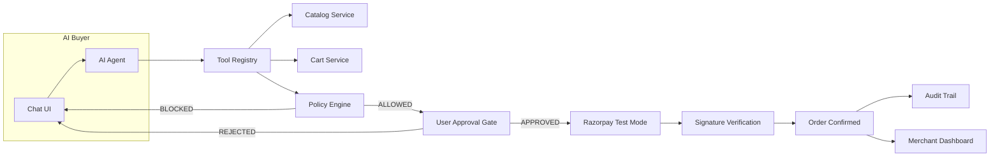

# RazorFlow AI

**An AI buyer that can safely transact with a merchant.**

> Built for the Razorpay AI Growth & Agentic Commerce hackathon track.

Every money action is **explainable**, **bounded**, and **gated**. The AI never directly controls money — a deterministic policy engine and explicit user approval gate stand between AI intent and any financial transaction.

## Current Status

| Phase | Status | Description |
|-------|--------|-------------|
| Phase 0 | 🔄 In Progress | Planning docs |
| Phase 1 | ⬜ Pending | Foundation (backend + frontend scaffolds) |
| Phase 2 | ⬜ Pending | Catalog & policy setup |
| Phase 3 | ⬜ Pending | AI agent + recommendations |
| Phase 4 | ⬜ Pending | Cart + upsell + policy tests |
| Phase 5 | ⬜ Pending | Approval gate |
| Phase 6 | ⬜ Pending | Razorpay payment |
| Phase 7 | ⬜ Pending | Failure handling + audit trail |
| Phase 8 | ⬜ Pending | Merchant dashboard |
| Phase 9 | ⬜ Pending | Policy settings + CSV + webhooks |
| Phase 10 | ⬜ Pending | UI polish |
| Phase 11 | ⬜ Pending | Analytics + funnel + demo mode |
| Phase 12 | ⬜ Pending | Tests + final polish |

## Architecture



### Core Safety: AI Does NOT Control Money

```
AI  →  "I want to buy this"  →  POLICY ENGINE  →  Allowed?
                                                      YES → User Approval → Razorpay API
                                                      NO  → BLOCK + explain
```

## Tech Stack

- **Backend:** Python 3.12+, FastAPI, SQLAlchemy, SQLite, Pydantic
- **Frontend:** Next.js, TypeScript, Tailwind CSS, shadcn/ui
- **AI:** Google Gemini Flash (lightweight, behind single-provider interface)
- **Payments:** Razorpay Test Mode (official Python SDK)

## Quick Start

### Backend
```bash
cd backend
python -m venv venv
venv\Scripts\activate       # Windows
pip install -r requirements.txt
cp .env.example .env        # Fill in your keys
python init_db.py           # Create DB + seed data
uvicorn main:app --reload   # http://localhost:8000
```

### Frontend
```bash
cd frontend
npm install
npm run dev                 # http://localhost:3000
```

### Environment Variables
```
# .env
LLM_PROVIDER=gemini
LLM_API_KEY=your_gemini_api_key
LLM_MODEL=gemini-2.0-flash-lite

RAZORPAY_KEY_ID=rzp_test_xxx
RAZORPAY_KEY_SECRET=xxx
RAZORPAY_WEBHOOK_SECRET=xxx
```

## Demo Script

1. Customer: *"I need running shoes for a marathon under ₹5,000"*
2. AI searches catalog → recommends RunPro Sprint (₹4,499) with reasoning
3. AI offers running socks (₹499) as upsell → customer accepts
4. Cart: ₹4,998 → policy check passes
5. Approval screen: "Approve Payment — ₹4,998" → customer approves
6. Razorpay test checkout → payment succeeds
7. Order confirmed → audit trail shows every step
8. Merchant dashboard updates with revenue

Then trigger payment failure scenario → safe recovery with no duplicate charges.

## Project Structure

```
razorflow-ai/
├── docs/           # Planning & architecture docs
├── backend/        # FastAPI + SQLAlchemy
│   ├── models/     # 12 SQLAlchemy models
│   ├── schemas/    # Pydantic request/response
│   ├── routers/    # API endpoints
│   ├── services/   # Business logic + AI agent
│   └── tests/      # pytest suite
└── frontend/       # Next.js + shadcn/ui
    └── src/
        ├── app/    # Pages (buyer, merchant, setup)
        ├── components/
        ├── hooks/
        └── lib/
```

## Known Limitations

*None yet — will document any cuts here.*
