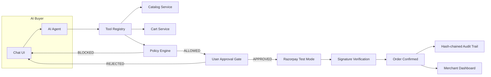

# RazorFlow AI

[](backend/tests)
[](frontend/src)
[](frontend/src)
[](LICENSE)
[](https://razorpay.com/docs/payments/test-mode/)

**An AI buyer that safely transacts with a merchant — and grows merchant revenue.**

Every money action is **explainable**, **bounded**, and **gated**. The AI never touches money directly: a deterministic policy engine and an explicit human approval gate stand between AI intent and every financial transaction — all on real Razorpay test-mode rails, all written to a tamper-evident audit trail.

🎬 **Watch the demo:** https://youtu.be/wim7gSKLrIA

> 🏆 Built for the **Razorpay AI Growth & Agentic Commerce Hackathon** — a reference implementation for safely gating AI transactions. Every design choice (deterministic policy engine, hash-chained audit, single-use approval tokens) reflects real financial risk patterns.

## Contents

- [See it in action](#see-it-in-action)
- [Quick Start (2 min)](#quick-start-2-min)
- [Core Capabilities](#core-capabilities)
- [Safety Model](#safety-model)
- [Installation](#installation)
- [Usage](#usage)
- [API Documentation](#api-documentation)
- [Configuration](#configuration)
- [Examples](#examples)
- [Architecture](#architecture)
- [Project Structure](#project-structure)
- [Testing](#testing)
- [Demo Script](#demo-script)
- [Troubleshooting](#troubleshooting)
- [What's Next](#whats-next)
- [Contributing](#contributing)
- [Limitations](#limitations)
- [License](#license)
- [Acknowledgments](#acknowledgments)

## See it in action

**No test card needed.** `/judge` runs all four stories with one button each:

- ✅ Happy path (successful purchase)
- 🚫 Policy blocked (spending limit hit)
- ❌ Payment failed & retry
- 📈 Merchant revenue impact

→ Load [http://localhost:3000/judge](http://localhost:3000/judge) after `npm run dev`.

## Quick Start (2 min)

```bash
cd backend && python -m venv venv && venv/Scripts/activate && pip install -r requirements.txt
cp .env.example .env  # Add your Groq + Razorpay keys
python init_db.py && uvicorn backend.main:app --reload &
cd ../frontend && npm install && npm run dev
# Open http://localhost:3000 → "Start buying with AI" → try: "I need shoes under ₹5000"
```

Need detail? See [Installation](#installation).

## Core Capabilities

**Chat layer** → Groq-powered recommendations with per-card reasoning
**Commerce layer** → Cart ops with zero LLM control
**Safety layer** → Deterministic policy + human approval gate
**Payment layer** → Razorpay test-mode checkout + verification + webhooks
**Merchant layer** → Revenue, AOV lift, funnel, and audit console

### Details

- 💬 Conversational discovery (Groq `qwen/qwen3.6-27b`, 5-key rotation, Ollama fallback), intent-aware loading, clickable suggestions
- 🛒 Add/update/remove by id *or name*, live totals + policy verdict on every mutation, automatic upsells with pairing reasons
- 🛡️ Policy engine: max/min transaction, session limit, quantity and upsell caps — editable in-buyer, approval gate hard-locked on
- ✅ Approval screen: itemized order, limits, remaining budget, single-use tokens, stale-amount expiry; renders via polling, never waits on LLM latency
- 💳 Server-created Razorpay orders, checkout.js modal, server-side signature verification, signed webhooks, 30s status polling, same-approval retry with no double charge
- 📊 Merchant console: revenue/AOV/conversion/upsell cards with demo-vs-live split, With-AI-vs-Without-AI diff, cumulative funnel, orders, full audit
- 🔍 Trust surfaces: audit trail with What/Why/Amount/Actor/Hash columns, live chain-intact badge, protocol Trace strip, frozen policy snapshots
- 🧑‍⚖️ Judge tooling: scripted scenarios, "Reset demo" (perfect judge state), "Simulate decline" (in-browser failure card + retry)

| | Manual checkout | RazorFlow AI |
|---|---|---|
| User approves every purchase | ✅ | ✅ |
| AI recommends, never auto-buys | ❌ | ✅ |
| Spending limits | Manual | Deterministic |
| Failure recovery | Dead end | Retry on same approval |
| Audit trail | ❌ | ✅ Hash-chained, verifiable live |

## Safety Model

```
AI  →  "I want to buy this"  →  POLICY ENGINE  →  Allowed?
                                                      YES → User Approval → Razorpay API
                                                      NO  → BLOCK + explain
```

The policy engine is the *only* path to payment. LLM recommendations → tools → policy verdict → approval gate → Razorpay. System-originated chat messages are answered from fixed text with zero LLM calls, so the agent can never hallucinate a paid order.

- LLM never touches the database; never invents products, prices, or stock
- All money is integer paise; all policy is deterministic backend code
- Single-use approval tokens (replays 403); stale-amount + policy re-checks at approve *and* create-order time
- Signatures verified against our own order records; webhooks signed with replay guard
- Failed payments consume zero budget; hash-chained audit recomputed live
- 120/min/IP rate limits on money routes; SQLite FK enforcement with startup orphan purge

## Installation

### Prerequisites

Python 3.12, Node.js 20+, Razorpay test-mode keys, Groq API key(s).

### Backend

```bash
cd backend
python -m venv venv
venv\Scripts\activate          # Windows
pip install -r requirements.txt
cp .env.example .env           # Fill in your keys (never commit .env)
python init_db.py              # Create DB + seed 15-product catalog
cd .. && backend\venv\Scripts\python.exe -m uvicorn backend.main:app --reload --port 8000
# API: http://localhost:8000  ·  Docs: http://localhost:8000/docs
```

> Run exactly **one** worker (the default). State gating is per-process; duplicate servers cause split-brain behavior.

### Frontend

```bash
cd frontend
npm install
npm run dev                    # http://localhost:3000
```

Buyer: `http://localhost:3000/buyer` · Merchant: `http://localhost:3000/merchant` · Judge: `http://localhost:3000/judge`

### Exposing webhooks locally

```bash
cloudflared tunnel --url http://localhost:8000
# Webhook URL: https://<tunnel-id>.trycloudflare.com/api/payment/webhook
```

Register the exact URL in the Razorpay Dashboard (events: `payment.captured`, `payment.failed`) and mirror the webhook secret into `.env` as `RAZORPAY_WEBHOOK_SECRET`.

## Usage

1. **Buy:** `/buyer` → chat or click a suggestion → Add → accept upsell → *"yes, checkout"* → gate appears on its own → Approve → Pay (card `4100 2800 0000 1007`).
2. **Break it:** decline card `4100 2800 0006 0003` (or **Simulate decline**) → failed card → **Retry payment** on the same approval.
3. **Tune it:** **Policy settings** in the buyer header, or `/setup` for the full form.
4. **Prove it:** `/merchant` for revenue + audit; **Trace** toggle for the turn's intent → tools → policy → approval → payment path.

## API Documentation

| Area | Key endpoints | Typical flow |
|------|---------------|--------------|
| Catalog | `GET /api/catalog/products`, `GET …/products/{id}/related` | Discover → recommend → upsell |
| Cart | `POST /api/cart`, `POST /api/cart/{id}/items`, `PUT/DELETE …/items/{item}` | Build cart, totals + policy attached |
| Agent | `POST /api/agent/chat`, `POST /api/agent/session` | Every chat turn |
| Checkout | `GET /api/checkout/summary/{cart}`, `POST …/request-approval`, `POST …/approve/{id}` | Mint gate → human decides |
| Payment | `POST /api/payment/create-order/{approval}`, `POST …/verify`, `POST …/webhook`, `GET …/status/{id}` | Order → pay → confirm → reconcile |
| Policy | `GET /api/policy`, `GET /api/policy/session-usage`, `PUT /api/policy/{id}` | Limits in, verdicts out |
| Audit | `GET /api/audit?session_id=…`, `GET /api/audit/verify` | Inspect → verify chain |
| Dashboard | `GET /api/dashboard/summary`, `GET /api/dashboard/funnel` | Merchant proof |
| Demo (`DEMO_MODE`) | `POST /api/demo/reset`, `…/seed-history`, `…/run-successful-purchase`, `…/run-payment-failure`, `…/run-policy-block` | One-click stories |
| Agent protocol | `GET /.well-known/ai-commerce.json` | Machine-readable storefront for external buyer agents |

Full schemas: `http://localhost:8000/docs`.

## Configuration

| Variable | Purpose | Default |
|----------|---------|---------|
| `LLM_PROVIDER` | `groq` / `ollama` / `gemini` / `auto` | `groq` |
| `LLM_API_KEY` / `LLM_API_KEYS` | Groq key + comma-separated rotation pool | empty |
| `LLM_MODEL` | Chat model | `qwen/qwen3.6-27b` |
| `RAZORPAY_KEY_ID` / `RAZORPAY_KEY_SECRET` | Test-mode credentials | empty |
| `RAZORPAY_WEBHOOK_SECRET` | Webhook signature secret | empty |
| `DEMO_MODE` | Judge/demo tooling | `True` |
| `DATABASE_URL` | SQLAlchemy URL (absolute path recommended) | `sqlite:///./razorflow.db` |
| `NEXT_PUBLIC_API_URL` | Frontend → backend base URL | `http://localhost:8000/api` |

## Examples

**Policy-blocked checkout (deterministic, no LLM):**

```bash
curl -X POST "http://localhost:8000/api/demo/run-policy-block?session_id=judge-policy"
# {"status":"blocked","cart_total_paise":899800,"allowed":false,
#  "reason":"Cart total ₹8998.00 exceeds maximum transaction limit of ₹5000.00", ...}
```

**Verify the audit chain live:**

```bash
curl http://localhost:8000/api/audit/verify
# {"ok":true,"break_at_id":null,"checked":64,"legacy_rows":0}
```

**Poll an ambiguous payment (what the UI does for 30s):**

```bash
curl "http://localhost:8000/api/payment/status/order_XXXX?session_id=YOUR_SESSION"
# {"status":"paid","verified":true,...} | {"status":"pending",...} | {"status":"failed",...}
```

## Architecture



## Project Structure

```
razorflow-ai/
├── backend/               # FastAPI + SQLAlchemy (63 source files)
│   ├── models/            # 13 SQLAlchemy models (cart, order, policy, approval, audit…)
│   ├── schemas/           # Pydantic request/response contracts
│   ├── routers/           # 10 routers: catalog, cart, agent, checkout,
│   │                      #   payment, policy, audit, dashboard, demo, well-known
│   ├── services/          # Business logic, AI agent, policy engine, state machine
│   ├── tests/             # 10 files, 174 pytest tests
│   ├── init_db.py         # DB creation + 15-product catalog seed
│   └── seed_demo_history.py  # Idempotent HIST-* demo-history seeder
└── frontend/              # Next.js 16 + React 19 + Tailwind + shadcn (37 files)
    ├── public/products/   # 15 product photos
    └── src/
        ├── app/           # Pages: landing, buyer, merchant, setup, judge
        ├── components/    # chat, commerce, audit, merchant, demo
        └── lib/           # API client, shared types, IST time helpers
```

## Testing

```bash
cd backend
$env:PYTHONPATH = "C:\projects\RazorFLow AI"   # Windows PowerShell
.\venv\Scripts\python.exe -m pytest tests/ -q
```

174 tests: token replay rejection, stale-amount 409s, retry-without-double-charge, chain recomputation, idempotent seeding, quota-resilience fallbacks, mocked-gateway payments with real HMAC signature vectors. Frontend gates: `npm run lint` (0 errors, 0 warnings), `npm run build` (offline-safe: system fonts, unoptimized images).

## Demo Script

The 2-minute version lives at `/judge`. Manual version:

1. *"I need marathon shoes under ₹5,000"* → RunPro Sprint (₹4,499) with reasoning
2. Accept the socks upsell (₹499) → totals + policy update live
3. Gate appears on its own → review → **Approve Purchase**
4. Card `4100 2800 0000 1007` → confirmed, cart empties, dashboard moves
5. Card `4100 2800 0006 0003` (or **Simulate decline**) → failed card → **Retry payment**, same approval
6. `/merchant`: revenue, With-vs-Without-AI diff, orders (amber demo chips vs emerald live ones), audit ledger with chain badge

## Troubleshooting

**Frontend: "API connection refused"**
- Backend must be on 8000: `uvicorn backend.main:app --reload --port 8000`
- `NEXT_PUBLIC_API_URL` must be `http://localhost:8000/api`

**Groq "rate limit / quota exceeded"**
- Add keys as `LLM_API_KEYS=key1,key2,key3` (auto-rotated); agent retries in-iteration and degrades to an honest message
- Ollama fallback covers fully-offline chat

**Razorpay webhook never fires**
- Tunnel must be public: `cloudflared tunnel --url http://localhost:8000`
- Exact tunnel URL registered under Razorpay Dashboard → Settings → Webhooks, secret mirrored to `RAZORPAY_WEBHOOK_SECRET`
- Without webhooks, browser-reported declines still reconcile via `POST /payment/report-failure`

**"DB is locked" on Windows**
- Run exactly one worker (`--workers 1`, the default); SQLite serializes the rest

## What's Next?

- [ ] Multi-merchant onboarding + per-merchant API keys
- [ ] Redis-backed session state + distributed rate limits
- [ ] PostgreSQL + versioned migrations
- [ ] Live Razorpay keys, refunds, settlements
- [ ] OAuth for the merchant console

Found a bug or want to contribute? See [Contributing](#contributing).

## Contributing

1. Fork the repo
2. Create your branch (`git checkout -b feature/amazing-feature`)
3. Cover backend changes with pytest; keep the frontend lint/build clean
4. Commit (`git commit -m 'Add amazing feature'`) — never commit `.env`, `*.db`, or keys
5. Push and open a Pull Request

House rules: money stays integer paise; safety logic stays out of the LLM path; money/policy endpoints log audit events; scripted things say scripted.

## Limitations

- **Demo-grade deployment surface.** Single merchant, single Uvicorn worker, SQLite file DB, localStorage sessions with no auth, and Razorpay test mode only — the safety *model* is production-shaped, the hosting is not (see [What's Next](#whats-next)).
- **Small-scale metrics.** The With-vs-Without-AI baseline is derived from our own paid orders minus upsell lines (no separate control group), conversion ≈ paid orders ÷ tracked AI sessions, and seeded/scripted rows are labeled, never blended — honest at demo scale, not statistically powered.

## License

This project is licensed under the MIT License — see the [LICENSE](LICENSE) file for details.

## Acknowledgments

- [Razorpay](https://razorpay.com) test mode + Python SDK for real gateway semantics without real money
- [Groq](https://groq.com) free-tier inference that makes the demo reproducible
- [FastAPI](https://fastapi.tiangolo.com), [Next.js](https://nextjs.org), [shadcn/ui](https://ui.shadcn.com), [Tailwind CSS](https://tailwindcss.com), [Lucide](https://lucide.dev)
