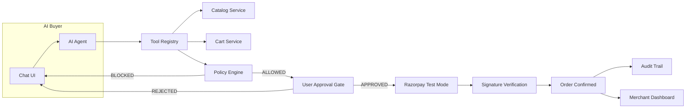

# RazorFlow AI

**An AI buyer that safely transacts with a merchant — and grows merchant revenue.**

> Built for the Razorpay AI Growth & Agentic Commerce hackathon track.

Every money action is **explainable**, **bounded**, and **gated**. The AI never directly controls money — a deterministic policy engine and an explicit user approval gate stand between AI intent and any financial transaction. Every step lands in a queryable audit trail.

- Buyer app: chat-driven shopping with cart, upsell, approval gate, and Razorpay test-mode checkout
- Merchant console: revenue dashboard, AI-impact comparison, commerce funnel, transaction audit

## Contents

- [Status](#status)
- [Architecture](#architecture)
- [Safety model](#safety-model)
- [Features](#features)
- [Tech stack](#tech-stack)
- [Quick start](#quick-start)
- [Configuration](#configuration)
- [API overview](#api-overview)
- [Testing](#testing)
- [Demo script](#demo-script)
- [Project structure](#project-structure)
- [Known limitations](#known-limitations)

## Status

| Phase | Status | Description |
|-------|--------|-------------|
| Phase 0 | ✅ Completed | Planning docs |
| Phase 1 | ✅ Completed | Foundation (backend + frontend scaffolds) |
| Phase 2 | ✅ Completed | AI agent + cart + policy engine + tests |
| Phase 3 | ✅ Completed | Approval gate + state machine |
| Phase 4 | ✅ Completed | Cart UI + upsell + LLM rotation |
| Phase 5 | ✅ Completed | Razorpay test-mode payment + failure handling |
| Phase 6 | ✅ Completed | Merchant dashboard + revenue analytics |
| Phase 7 | ✅ Completed | Funnel, demo mode, hardening, UI polish |

## Architecture



### Core Safety: AI Does NOT Control Money

```
AI  →  "I want to buy this"  →  POLICY ENGINE  →  Allowed?
                                                      YES → User Approval → Razorpay API
                                                      NO  → BLOCK + explain
```

Deterministic backend code owns totals, policy checks, approvals, orders, and signature verification. The LLM only ever **recommends** (search, explain, upsell) and expresses cart intent — it cannot set prices, skip policy, auto-approve, or confirm payments. Checkout intent, "more options" follow-ups, and upsell attachment all run as deterministic code paths, which is why a full purchase costs ~3 LLM calls instead of 8.

### Safety Guarantees

- LLM never directly accesses the database
- LLM never invents product data, prices, or stock
- All policy decisions are deterministic backend code
- All prices stored as integers in paise (₹1 = 100 paise)
- Approval requires explicit user acceptance
- Payment signatures verified server-side against our own order records before fulfilment
- Rate limits (120/min/IP) on the money-adjacent `/api/payment/*` and `/api/checkout/*` surfaces

## Features

**Buyer (`/buyer`)**
- Conversational product discovery with per-card "why this fits" reasoning and product photos
- Cart with quantity controls, automatic policy feedback, and rule-based upsell panel
- Approval screen showing itemized order, upsell pairing reasons, spending limit, and remaining budget
- Razorpay Standard Checkout (test mode) with server-side signature verification and graceful failure recovery
- Persistent session spending-limit bar and expandable live audit trail

**Merchant (`/merchant`)**
- Revenue dashboard: total revenue, AOV, AI conversion, upsell revenue — all-time and today
- Honestly-labeled baseline comparison ("AI orders excluding upsell items", derived from real orders)
- Cumulative commerce funnel with per-stage drop-off
- Recent orders table and full transaction audit table

**Demo controls** (gated on `DEMO_MODE`): one-click reset, scripted successful purchase, scripted payment failure, and guaranteed upsell scenario — all LLM-free for stage reliability.

## Tech Stack

- **Backend:** Python 3.12, FastAPI, SQLAlchemy, SQLite, Pydantic — [pytest](https://pytest.org/) suite (128 tests)
- **Frontend:** Next.js 16, React 19, TypeScript 5, Tailwind CSS 4, shadcn/ui components
- **AI:** Groq (`qwen/qwen3.6-27b`) with 5-key rotation, Ollama fallback for local dev, Gemini supported — behind a single-provider `LLMClient` interface
- **Payments:** Razorpay Test Mode via the official Python SDK (`razorpay>=1.4.1`); Standard Checkout (`checkout.js`) on the frontend

## Quick Start

### Backend
```bash
cd backend
python -m venv venv
venv\Scripts\activate       # Windows
pip install -r requirements.txt
cp .env.example .env        # Fill in your keys (never commit .env)
python init_db.py           # Create DB + seed 15-product catalog
cd .. && backend\venv\Scripts\python.exe -m uvicorn backend.main:app --reload --port 8000
# API: http://localhost:8000  ·  Docs: http://localhost:8000/docs
```

### Frontend
```bash
cd frontend
npm install
npm run dev                 # http://localhost:3000
```

Buyer app: `http://localhost:3000/buyer` · Merchant console: `http://localhost:3000/merchant`

### Exposing webhooks locally
Razorpay cannot reach `localhost`. Run a tunnel and register the exact URL in the Razorpay Dashboard (events: `payment.captured`, `payment.failed`):
```bash
cloudflared tunnel --url http://localhost:8000
# Webhook URL: https://<tunnel-id>.trycloudflare.com/api/payment/webhook
```
Mirror the dashboard's webhook secret into `.env` as `RAZORPAY_WEBHOOK_SECRET`.

## Configuration

| Variable | Purpose | Default |
|----------|---------|---------|
| `LLM_PROVIDER` | `groq` / `ollama` / `gemini` / `auto` | `groq` |
| `LLM_API_KEY` / `LLM_API_KEYS` | Groq key + comma-separated rotation pool | empty |
| `LLM_MODEL` | Chat model | `qwen/qwen3.6-27b` |
| `RAZORPAY_KEY_ID` / `RAZORPAY_KEY_SECRET` | Test-mode API credentials | empty |
| `RAZORPAY_WEBHOOK_SECRET` | Webhook signature secret | empty |
| `DEMO_MODE` | Show demo controls panel | `True` |
| `DATABASE_URL` | SQLAlchemy URL | `sqlite:///./razorflow.db` |

## API Overview

| Area | Example endpoints |
|------|-------------------|
| Catalog | `GET /api/catalog/products`, `GET /api/catalog/products/{id}/related` |
| Cart | `POST /api/cart`, `POST /api/cart/{id}/items`, `PUT …/items/{item}` |
| Agent | `POST /api/agent/chat`, `POST /api/agent/session` |
| Checkout | `GET /api/checkout/summary/{cart}`, `POST /api/checkout/request-approval`, `POST /api/checkout/approve/{id}` |
| Payment | `POST /api/payment/create-order/{approval}`, `POST /api/payment/verify`, `POST /api/payment/webhook` |
| Policy | `GET /api/policy`, `GET /api/policy/session-usage`, `POST /api/policy/check` |
| Audit | `GET /api/audit?session_id=…` |
| Dashboard | `GET /api/dashboard/summary`, `GET /api/dashboard/funnel` |
| Demo | `POST /api/demo/reset`, `POST /api/demo/run-successful-purchase`, `POST /api/demo/run-payment-failure`, `POST /api/demo/run-upsell-scenario` |
| Agent protocol | `GET /.well-known/ai-commerce.json` — UAP-compatible machine-readable catalog, policy bounds, and purchase flow for external buyer agents |

## Testing

```bash
cd backend
$env:PYTHONPATH = "C:\projects\RazorFLow AI"   # Windows PowerShell
.\venv\Scripts\python.exe -m pytest tests/ -q
```

128 tests: agent (45), catalog (16), cart (13), payment (21), policy (8), dashboard (9), checkout (6), audit (5), demo (5). Payment tests use a mocked gateway; signature tests run real HMAC vectors; the end-to-end test drives discovery → paid order and asserts the full audit chain.

## Demo Script

1. Customer: *"I need marathon shoes under ₹5,000"* → AI recommends RunPro Sprint (₹4,499) with reasoning
2. AI offers running socks (₹499) as upsell → customer accepts (or click **Run upsell scenario** in Demo Controls)
3. Approval screen shows itemized order, limits, and remaining budget → customer approves
4. **Pay securely with Razorpay** → test card `4100 2800 0000 1007` (success) → order confirmed, cart empties, dashboard updates
5. Failure path: test card `4100 2800 0006 0003` declines → "no charge was made" + Retry on the same approval (or click **Run payment failure**)
6. Merchant console shows revenue, uplift chart, funnel, and the full audit ledger

## Project Structure

```
razorflow-ai/
├── docs/             # Planning & architecture docs
├── shoes/            # Source product photography (seed assets)
├── backend/          # FastAPI + SQLAlchemy
│   ├── models/       # 13 SQLAlchemy models
│   ├── schemas/      # Pydantic request/response
│   ├── routers/      # 9 routers: catalog, cart, agent, checkout,
│   │   │             #   payment, policy, audit, dashboard, demo
│   ├── services/     # Business logic, AI agent, policy engine, state machine
│   └── tests/        # 9 files, 128 pytest tests
└── frontend/         # Next.js + shadcn/ui
    ├── public/products/  # 15 product photos
    └── src/
        ├── app/          # Pages (buyer, merchant, setup)
        ├── components/   # 26 components: chat, commerce, audit, merchant, demo
        └── lib/          # API client + shared types
```

## Known Limitations

- **Single hard-coded merchant (id 1).** Multi-merchant isolation, onboarding, and per-merchant keys are not implemented.
- **In-memory session state.** The state machine and agent history live in process memory — a backend restart loses conversation state and state-machine position (the DB rows survive).
- **SQLite + local file DB.** Fine for demo scale; no migrations (schema changes need a fresh `init_db.py` run), no concurrency hardening.
- **Groq free-tier quotas.** 5 rotating test keys share ~200K tokens/day; heavy demoing can exhaust them and the chat degrades to error messages until reset.
- **Razorpay test mode only.** Live keys, refunds, settlements, and dispute handling are not wired. Webhook delivery needs a public tunnel (ngrok/cloudflared) in local dev.
- **Light theme covers the buyer + merchant flows only.** The landing (`/`) and setup (`/setup`) pages are still dark.
- **No auth.** Buyer sessions are unsecured localStorage IDs; the merchant console has no login.
- **Upsell fallback is rule-based (tags), not personalized.** Explicit merchant relations win; everything else matches on shared tags.
- **Product photos are static seed assets**, not merchant-uploaded; catalog uploads don't attach images.
- **Synthetic baseline methodology.** The dashboard's "no-upsell baseline" is derived from our own paid orders minus their upsell lines — there is no separate non-AI control group, and it is labeled as such in the API. Conversion rate is paid orders ÷ distinct AI sessions (an approximation; sessions that never touch the assistant aren't counted).
- **Rate limiting is per-process memory** (120/min/IP on payment + checkout). It does not survive restarts and won't hold across multiple server instances.
- **Demo triggers synthesize the gateway capture** for the success path (flagged `simulated: true` in audit data) so the stage demo never depends on live LLM output; the Razorpay order itself is real. The failure path exercises the genuine rejection code.
