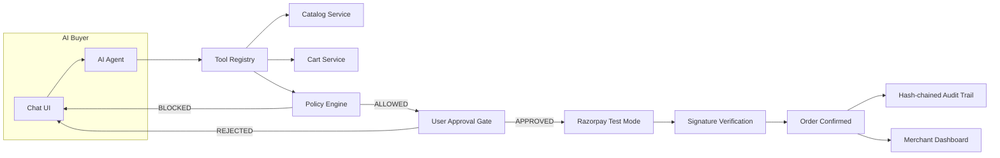

# RazorFlow AI

[](backend/tests)
[](frontend/src)
[](frontend/src)
[](LICENSE)
[](https://razorpay.com/docs/payments/test-mode/)

**An AI buyer that safely transacts with a merchant — and grows merchant revenue.**

> Built for the Razorpay AI Growth & Agentic Commerce hackathon track.

Every money action is **explainable**, **bounded**, and **gated**. The AI never directly controls money — a deterministic policy engine and an explicit human approval gate stand between AI intent and any financial transaction. Every step lands in a tamper-evident audit trail.

- **Buyer app** (`/buyer`): chat-driven shopping with cart, upsells, approval gate, and Razorpay test-mode checkout
- **Merchant console** (`/merchant`): revenue dashboard, AI-impact comparison, commerce funnel, transaction audit
- **Judge mode** (`/judge`): one-click Happy path, Policy blocked, Payment failed, and Merchant impact scenarios

## Contents

- [Features](#features)
- [Installation](#installation)
- [Usage & Quick Start](#usage--quick-start)
- [API Documentation](#api-documentation)
- [Configuration](#configuration)
- [Examples](#examples)
- [Safety Model](#safety-model)
- [Architecture](#architecture)
- [Project Structure](#project-structure)
- [Testing](#testing)
- [Demo Script](#demo-script)
- [Contributing](#contributing)
- [Known Limitations](#known-limitations)
- [License](#license)
- [Acknowledgments](#acknowledgments)

## Features

- 💬 **Conversational commerce** — SprintGroq-powered assistant (Groq `qwen/qwen3.6-27b`, 5-key rotation, Ollama fallback) with per-card "why this fits" reasoning, intent-aware loading stages, and clickable suggestion chips
- 🛒 **Zero-LLM cart ops** — add/update/remove (by id *or name*), live totals + policy verdict on every mutation, in-cart filtering, newest-wins panels
- 🛡️ **Policy engine** — max/min transaction, session spending limit, per-item quantity cap, upsell cap/flag, all enforced deterministically with a live limit bar and in-buyer editable settings (approval gate hard-locked on)
- ✅ **Human approval gate** — itemized summary with upsell pairing reasons, limits + remaining budget, single-use tokens, stale-amount expiry, restart recovery; renders via 2.5s polling, never waiting on LLM latency
- 💳 **Razorpay test mode** — server-created orders, checkout.js modal, server-side signature verification, signed webhooks (`captured`/`failed`), 30s status polling on ambiguous outcomes, same-approval retry with no double charge
- 📊 **Merchant console** — revenue/AOV/conversion/upsell cards with demo-vs-live split, AOV-impact bars, cumulative funnel, orders table, full audit
- 🔍 **Trust surfaces** — audit trail with What/Why/Amount/Actor/Policy·hash columns, live chain-intact badge, `GET /api/audit/verify`; protocol Trace strip (intent → tools → policy → approval → payment); frozen policy snapshots in every approval
- 🧑‍⚖️ **Judge mode** — scripted, honestly-labeled scenario triggers plus "Reset demo" (perfect judge state) and "Simulate decline" (in-browser failure card + retry)

## Installation

### Prerequisites

- Python 3.12, Node.js 20+, Razorpay test-mode keys, Groq API key(s)

### Backend

```bash
cd backend
python -m venv venv
venv\Scripts\activate          # Windows
pip install -r requirements.txt
cp .env.example .env           # Fill in your keys (never commit .env)
python init_db.py              # Create DB + seed 15-product catalog
cd .. && backend\venv\Scripts\python.exe -m uvicorn backend.main:app --reload --port 8000
# API: http://localhost:8000  ·  Docs: http://localhost:8000/docs
```

> Run exactly **one** worker (the default). The state machine and hot caches are per-process; duplicate servers cause split-brain DB behavior.

### Frontend

```bash
cd frontend
npm install
npm run dev                    # http://localhost:3000
```

### Exposing webhooks locally

Razorpay cannot reach `localhost`. Run a tunnel and register the exact URL in the Razorpay Dashboard (events: `payment.captured`, `payment.failed`):

```bash
cloudflared tunnel --url http://localhost:8000
# Webhook URL: https://<tunnel-id>.trycloudflare.com/api/payment/webhook
```

Mirror the dashboard's webhook secret into `.env` as `RAZORPAY_WEBHOOK_SECRET`.

## Usage & Quick Start

1. Open `http://localhost:3000` → **Start buying with AI**.
2. Chat: *"I need marathon shoes under ₹5,000"* → AI recommends RunPro Sprint (₹4,499) with reasoning.
3. Accept the socks upsell (or add items directly — no LLM needed).
4. The approval gate appears automatically → review itemized order, limits, remaining budget → **Approve Purchase**.
5. **Pay securely with Razorpay** → test card `4100 2800 0000 1007` → order confirmed, cart empties, merchant dashboard updates.
6. Decline path: test card `4100 2800 0006 0003` → crisp failed-payment card → **Retry payment** on the same approval.

Prefer clicks over typing? `/judge` runs all four stories (happy, blocked, failed, impact) with one button each.

## API Documentation

| Area | Endpoints |
|------|-----------|
| Catalog | `GET /api/catalog/products`, `GET /api/catalog/products/{id}/related` |
| Cart | `POST /api/cart`, `GET /api/cart/{id}`, `POST /api/cart/{id}/items`, `PUT …/items/{item}`, `DELETE …/items/{item}` |
| Agent | `POST /api/agent/chat`, `POST /api/agent/session`, `GET /api/agent/session/{id}` |
| Checkout | `GET /api/checkout/summary/{cart}`, `GET /api/checkout/approval/{id}/summary`, `POST /api/checkout/request-approval`, `POST /api/checkout/approve/{id}`, `POST /api/checkout/reject/{id}` |
| Payment | `GET /api/payment/config`, `GET /api/payment/status/{rzrOrderId}`, `POST /api/payment/create-order/{approval}`, `POST /api/payment/verify`, `POST /api/payment/webhook` |
| Policy | `GET /api/policy`, `GET /api/policy/session-usage`, `POST /api/policy`, `PUT /api/policy/{id}`, `POST /api/policy/check` |
| Audit | `GET /api/audit?session_id=…`, `GET /api/audit/verify` |
| Dashboard | `GET /api/dashboard/summary`, `GET /api/dashboard/funnel` |
| Demo (`DEMO_MODE` only) | `POST /api/demo/reset`, `POST /api/demo/seed-history`, `POST /api/demo/run-successful-purchase`, `POST /api/demo/run-payment-failure`, `POST /api/demo/run-upsell-scenario`, `POST /api/demo/run-policy-block` |
| Agent protocol | `GET /.well-known/ai-commerce.json` — machine-readable catalog, policy bounds, and purchase flow for external buyer agents |

Interactive docs with schemas: `http://localhost:8000/docs`.

## Configuration

| Variable | Purpose | Default |
|----------|---------|---------|
| `LLM_PROVIDER` | `groq` / `ollama` / `gemini` / `auto` | `groq` |
| `LLM_API_KEY` / `LLM_API_KEYS` | Groq key + comma-separated rotation pool | empty |
| `LLM_MODEL` | Chat model | `qwen/qwen3.6-27b` |
| `RAZORPAY_KEY_ID` / `RAZORPAY_KEY_SECRET` | Test-mode API credentials | empty |
| `RAZORPAY_WEBHOOK_SECRET` | Webhook signature secret | empty |
| `DEMO_MODE` | Show demo/judge tooling | `True` |
| `DATABASE_URL` | SQLAlchemy URL (absolute path recommended) | `sqlite:///./razorflow.db` |
| `NEXT_PUBLIC_API_URL` | Frontend → backend base URL | `http://localhost:8000/api` |

## Examples

**Policy-blocked checkout (deterministic, no LLM):**

```bash
curl -X POST "http://localhost:8000/api/demo/run-policy-block?session_id=judge-policy"
# {"status":"blocked","cart_total_paise":899800,"allowed":false,
#  "reason":"Cart total ₹8998.00 exceeds maximum transaction limit of ₹5000.00", ...}
```

**Verify the audit chain live:**

```bash
curl http://localhost:8000/api/audit/verify
# {"ok":true,"break_at_id":null,"checked":58,"legacy_rows":1}
```

**Poll an ambiguous payment (what the UI does for 30s):**

```bash
curl "http://localhost:8000/api/payment/status/order_XXXX?session_id=YOUR_SESSION"
# {"status":"paid","verified":true,...} | {"status":"pending",...} | {"status":"failed",...}
```

## Safety Model

```
AI  →  "I want to buy this"  →  POLICY ENGINE  →  Allowed?
                                                      YES → User Approval → Razorpay API
                                                      NO  → BLOCK + explain
```

Deterministic backend code owns totals, policy checks, approvals, orders, and signature verification. The LLM only **recommends** and expresses cart intent through 9 tools — it cannot set prices, skip policy, auto-approve, or confirm payments. System-originated chat messages (approval/payment echoes) are answered from fixed text with zero LLM calls, so the agent can never hallucinate a paid order.

### Safety Guarantees

- LLM never directly accesses the database
- LLM never invents product data, prices, or stock
- All policy decisions are deterministic backend code; all money is integer paise
- Approval requires explicit user action + single-use token (replays 403)
- Stale-amount and policy re-checks at approve *and* create-order time
- Payment signatures verified server-side against our own order records
- Hash-chained audit log, verifiable live; failed payments consume zero budget
- Rate limits (120/min/IP) on `/api/payment/*` and `/api/checkout/*`; SQLite FK enforcement with startup orphan purge

## Architecture



## Project Structure

```
razorflow-ai/
├── backend/               # FastAPI + SQLAlchemy (63 source files)
│   ├── models/            # 13 SQLAlchemy models (cart, order, policy, approval, audit…)
│   ├── schemas/           # Pydantic request/response contracts
│   ├── routers/           # 10 routers: catalog, cart, agent, checkout,
│   │                      #   payment, policy, audit, dashboard, demo, well-known
│   ├── services/          # Business logic, AI agent, policy engine, state machine
│   ├── tests/             # 10 files, 174 pytest tests
│   ├── init_db.py         # DB creation + 15-product catalog seed
│   └── seed_demo_history.py  # Idempotent HIST-* demo-history seeder
└── frontend/              # Next.js 16 + React 19 + Tailwind + shadcn (37 files)
    ├── public/products/   # 15 product photos
    └── src/
        ├── app/           # Pages: landing, buyer, merchant, setup, judge
        ├── components/    # chat, commerce, audit, merchant, demo
        └── lib/           # API client + shared types
```

## Testing

```bash
cd backend
$env:PYTHONPATH = "C:\projects\RazorFLow AI"   # Windows PowerShell
.\venv\Scripts\python.exe -m pytest tests/ -q
```

174 tests: agent, catalog, cart, payment, policy, dashboard, checkout, audit, demo. Payment tests use a mocked gateway; signature tests run real HMAC vectors; retry tests prove one approval → one paid order with no double charge; the chain test recomputes every audit hash. Frontend gates: `npm run lint` (0 errors, 0 warnings) and `npm run build` (offline-safe: no remote fonts, `next/image` unoptimized).

## Demo Script

The 2-minute version lives at `/judge` (one button per story). The manual version:

1. *"I need marathon shoes under ₹5,000"* → RunPro Sprint (₹4,499) with reasoning
2. Accept the socks upsell (₹499) → policy-checked totals update live
3. Approval gate appears on its own → review → **Approve Purchase**
4. Razorpay test card `4100 2800 0000 1007` → confirmed, cart empties, dashboard moves
5. Decline card `4100 2800 0006 0003` (or **Simulate decline**) → failed card → **Retry payment** on the same approval
6. `/merchant` shows revenue, AOV lift, funnel, and the audit ledger with the chain-intact badge

## Contributing

Bug reports and pull requests are welcome via GitHub Issues/PRs:

1. Fork the repository
2. Create your feature branch (`git checkout -b feature/amazing-feature`)
3. Keep backend changes covered by pytest and frontend changes lint-clean (`npm run lint`, `npm run build`)
4. Commit (`git commit -m 'Add amazing feature'`) — never commit `.env`, `*.db`, or API keys
5. Push (`git push origin feature/amazing-feature`) and open a Pull Request

Coding standards: integer paise for all money, deterministic safety logic stays out of the LLM path, every new endpoint needs an audit event where money or policy is involved, UI copy stays honest (scripted things say scripted).

## Known Limitations

- **Single hard-coded merchant (id 1).** Multi-merchant isolation, onboarding, and per-merchant keys are not implemented.
- **In-memory session state.** The state machine gate and hot conversation cache live in process memory — run exactly **one** Uvicorn worker. Mitigations: chat history rehydrates from durable `AIInteraction` rows, and approval/payment gates recover from `Approval`/`Order` rows after a restart.
- **SQLite + local file DB.** Fine for demo scale; schema evolves via startup `create_all` + compat migrator + orphan purge, not versioned migrations; no concurrency hardening.
- **Groq free-tier quotas.** Rotating keys share ~200K tokens/day; exhaustion now retries in-iteration and degrades to an honest catalog-aware message.
- **Razorpay test mode only.** Live keys, refunds, settlements, disputes are not wired. Local webhooks need a public tunnel.
- **No auth.** Buyer sessions are unsecured localStorage IDs; the merchant console has no login.
- **Synthetic methodology, labeled.** The "no-upsell baseline" is derived from our own paid orders minus upsell lines (no separate control group); conversion ≈ paid orders ÷ AI sessions; HIST-* demo history is split from live RF-* revenue, never blended.
- **Rate limiting is per-process memory** (120/min/IP). Demo triggers synthesize the success capture (append-only `DEMO_SIMULATED_CAPTURE` event); the Razorpay order itself is real.
- **Audit log is hash-chained, not immutable.** A DB admin can rewrite history — the chain then fails verification at the edited row, which is the point. `POST /api/demo/reset` is deliberately destructive.

## License

This project is licensed under the MIT License — see the [LICENSE](LICENSE) file for details.

## Acknowledgments

- [Razorpay](https://razorpay.com) test mode + Python SDK for real gateway semantics without real money
- [Groq](https://groq.com) free-tier LPU inference that makes the demo reproducible
- [FastAPI](https://fastapi.tiangolo.com), [Next.js](https://nextjs.org), [shadcn/ui](https://ui.shadcn.com), [Tailwind CSS](https://tailwindcss.com), [Lucide](https://lucide.dev) for the stack
- UAP (Universal Agentic Protocol) conventions behind `/.well-known/ai-commerce.json`
