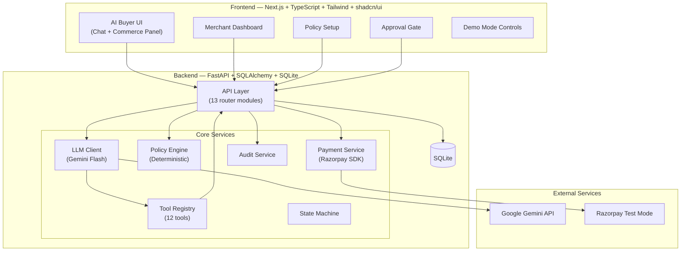

# RazorFlow AI — Architecture

## System Diagram



## Component Responsibilities

| Component | Responsibility |
|-----------|---------------|
| **API Layer** | HTTP routing, request validation, response serialization. 13 router modules. |
| **LLM Client** | Single-provider Gemini interface. `generate(messages, tools) → response`. Never touches DB or payments. |
| **Tool Registry** | 12 callable tools the LLM can invoke. Read-only catalog tools + write cart tools + backend-gated sensitive tools. |
| **Policy Engine** | Deterministic spending/quantity checks against live `CommercePolicy`. Returns ALLOWED/BLOCKED. No AI involvement. |
| **State Machine** | Tracks session state (IDLE→DISCOVERING→...→ORDER_CONFIRMED). Rejects invalid transitions. |
| **Payment Service** | Razorpay SDK wrapper. Server-side order creation, signature verification. Amount recalculated from DB. |
| **Audit Service** | Logs all events with timestamps. Backbone of the "explainable" requirement. |

## LLM Boundary Enforcement

The LLM operates in a sandbox:
1. It receives user messages and the tool registry (JSON schemas)
2. It returns text responses or tool call requests
3. The backend executes tool calls, returns results
4. The LLM **never** gets direct DB access, Razorpay access, or policy override ability

```
User Message → Agent Orchestrator → LLM → Tool Call Request
                                             ↓
                                    Backend executes tool
                                             ↓
                                    Tool result → LLM → Response
```

## Policy Gate Enforcement

```
AI: "Create order for cart #42"
    ↓
Policy Engine reads CommercePolicy from DB
    ↓
Check: cart total ≤ max_transaction? quantities ≤ max? session spend ≤ limit?
    ↓
ALLOWED → Create Approval (status: pending) → Wait for user click
BLOCKED → Return reason to AI → AI explains to user
```

The Approval record must have `status='approved'` (set by user action, not AI) before `payments/create-order` will proceed.
