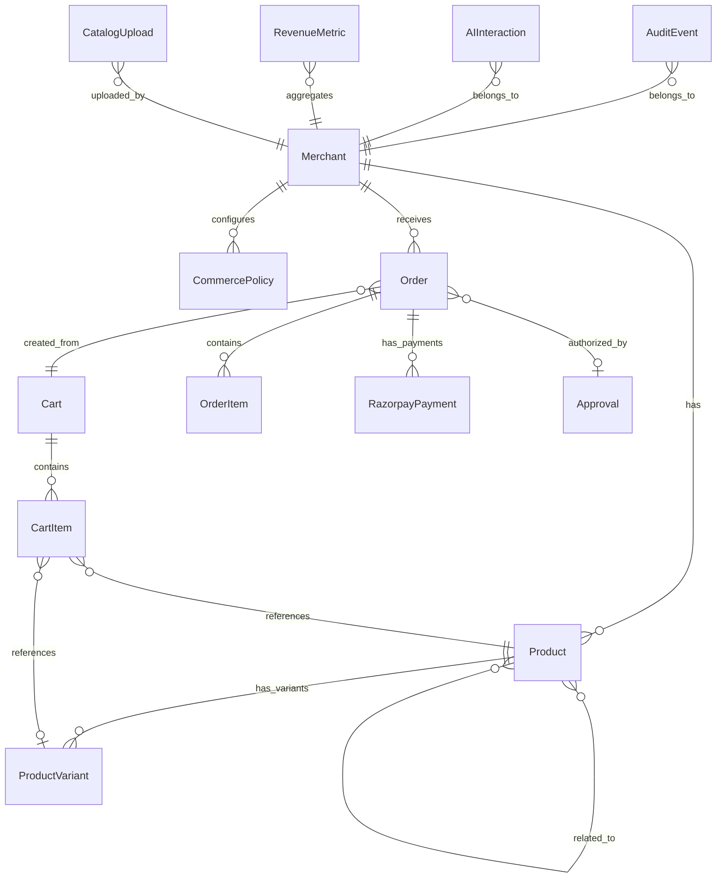

# RazorFlow AI — Database Schema

All money stored as **integers in paise** (1 rupee = 100 paise). Never binary floats.

## Entity Relationship Diagram



## Models

### Merchant
| Column | Type | Constraints | Notes |
|--------|------|-------------|-------|
| id | Integer | PK, autoincrement | |
| name | String(255) | NOT NULL | |
| email | String(255) | UNIQUE | |
| razorpay_key_id | String(255) | NULLABLE | Test mode key |
| created_at | DateTime | DEFAULT now() | |

### Product
| Column | Type | Constraints | Notes |
|--------|------|-------------|-------|
| id | Integer | PK, autoincrement | |
| merchant_id | Integer | FK → Merchant.id | |
| name | String(255) | NOT NULL | |
| description | Text | | Human-readable |
| ai_description | Text | | AI-optimized structured description |
| category | String(100) | NOT NULL | |
| base_price_paise | Integer | NOT NULL | In paise |
| image_url | String(500) | NULLABLE | |
| tags | JSON | DEFAULT [] | |
| is_active | Boolean | DEFAULT true | |
| created_at | DateTime | DEFAULT now() | |

### product_relations (M2M join table)
| Column | Type | Constraints |
|--------|------|-------------|
| product_id | Integer | PK, FK → Product.id |
| related_product_id | Integer | PK, FK → Product.id |

### ProductVariant
| Column | Type | Constraints | Notes |
|--------|------|-------------|-------|
| id | Integer | PK, autoincrement | |
| product_id | Integer | FK → Product.id | |
| name | String(100) | NOT NULL | e.g. "Size 10" |
| sku | String(50) | UNIQUE | |
| price_paise | Integer | NOT NULL | Variant-specific price |
| stock_quantity | Integer | DEFAULT 0 | |
| attributes | JSON | DEFAULT {} | e.g. {"size": "10", "color": "black"} |

### Cart
| Column | Type | Constraints | Notes |
|--------|------|-------------|-------|
| id | Integer | PK, autoincrement | |
| session_id | String(100) | NOT NULL | |
| customer_id | String(100) | DEFAULT "demo_customer" | |
| merchant_id | Integer | FK → Merchant.id | |
| status | String(20) | DEFAULT "active" | active/checked_out/abandoned |
| created_at | DateTime | DEFAULT now() | |
| updated_at | DateTime | DEFAULT now(), on_update now() | |

### CartItem
| Column | Type | Constraints | Notes |
|--------|------|-------------|-------|
| id | Integer | PK, autoincrement | |
| cart_id | Integer | FK → Cart.id | |
| product_id | Integer | FK → Product.id | |
| variant_id | Integer | FK → ProductVariant.id, NULLABLE | |
| quantity | Integer | NOT NULL, > 0 | |
| unit_price_paise | Integer | NOT NULL | Snapshotted at add time |
| is_upsell | Boolean | DEFAULT false | Tracks upsell items |
| created_at | DateTime | DEFAULT now() | |

### CommercePolicy
| Column | Type | Constraints | Notes |
|--------|------|-------------|-------|
| id | Integer | PK, autoincrement | |
| merchant_id | Integer | FK → Merchant.id | |
| max_transaction_amount_paise | Integer | NOT NULL | |
| require_approval | Boolean | DEFAULT true | |
| max_quantity_per_item | Integer | DEFAULT 5 | |
| allow_upsell | Boolean | DEFAULT true | |
| max_upsell_amount_paise | Integer | NOT NULL | |
| allow_auto_retry | Boolean | DEFAULT false | |
| spending_limit_paise | Integer | NOT NULL | Per session |
| is_active | Boolean | DEFAULT true | |
| created_at | DateTime | DEFAULT now() | |
| updated_at | DateTime | DEFAULT now() | |

### Order
| Column | Type | Constraints | Notes |
|--------|------|-------------|-------|
| id | Integer | PK, autoincrement | |
| order_number | String(50) | UNIQUE | Display-friendly: "ORD-001" |
| merchant_id | Integer | FK → Merchant.id | |
| customer_id | String(100) | DEFAULT "demo_customer" | |
| session_id | String(100) | | |
| cart_id | Integer | FK → Cart.id | |
| subtotal_paise | Integer | NOT NULL | |
| total_paise | Integer | NOT NULL | |
| status | String(20) | DEFAULT "pending" | pending/paid/failed/cancelled |
| is_ai_assisted | Boolean | DEFAULT true | |
| upsell_revenue_paise | Integer | DEFAULT 0 | |
| razorpay_order_id | String(100) | NULLABLE | |
| created_at | DateTime | DEFAULT now() | |

### OrderItem
| Column | Type | Constraints | Notes |
|--------|------|-------------|-------|
| id | Integer | PK, autoincrement | |
| order_id | Integer | FK → Order.id | |
| product_id | Integer | FK → Product.id | |
| variant_id | Integer | FK → ProductVariant.id, NULLABLE | |
| product_name | String(255) | NOT NULL | Snapshot |
| quantity | Integer | NOT NULL | |
| unit_price_paise | Integer | NOT NULL | |
| total_paise | Integer | NOT NULL | |
| is_upsell | Boolean | DEFAULT false | |

### RazorpayPayment
| Column | Type | Constraints | Notes |
|--------|------|-------------|-------|
| id | Integer | PK, autoincrement | |
| order_id | Integer | FK → Order.id | |
| razorpay_order_id | String(100) | NOT NULL | |
| razorpay_payment_id | String(100) | NULLABLE | |
| razorpay_signature | String(500) | NULLABLE | |
| amount_paise | Integer | NOT NULL | |
| currency | String(10) | DEFAULT "INR" | |
| status | String(20) | DEFAULT "created" | created/authorized/captured/failed/refunded |
| method | String(50) | NULLABLE | |
| error_code | String(100) | NULLABLE | |
| error_description | Text | NULLABLE | |
| verified | Boolean | DEFAULT false | |
| idempotency_key | String(100) | UNIQUE, NULLABLE | |
| created_at | DateTime | DEFAULT now() | |
| updated_at | DateTime | DEFAULT now() | |

### Approval
| Column | Type | Constraints | Notes |
|--------|------|-------------|-------|
| id | Integer | PK, autoincrement | |
| session_id | String(100) | NOT NULL | |
| order_id | Integer | FK → Order.id, NULLABLE | |
| cart_id | Integer | FK → Cart.id | |
| requested_amount_paise | Integer | NOT NULL | |
| status | String(20) | DEFAULT "pending" | pending/approved/rejected/expired |
| summary_json | JSON | NOT NULL | Full purchase breakdown |
| approved_at | DateTime | NULLABLE | |
| created_at | DateTime | DEFAULT now() | |

### AuditEvent
| Column | Type | Constraints | Notes |
|--------|------|-------------|-------|
| id | Integer | PK, autoincrement | |
| session_id | String(100) | NULLABLE | |
| merchant_id | Integer | FK → Merchant.id | |
| event_type | String(50) | NOT NULL | See enum below |
| event_data | JSON | DEFAULT {} | |
| actor | String(20) | NOT NULL | "user"/"ai"/"system" |
| timestamp | DateTime | DEFAULT now() | |
| related_entity_type | String(50) | NULLABLE | "order"/"cart"/"product" etc |
| related_entity_id | Integer | NULLABLE | |

### AIInteraction
| Column | Type | Constraints | Notes |
|--------|------|-------------|-------|
| id | Integer | PK, autoincrement | |
| session_id | String(100) | NOT NULL | |
| merchant_id | Integer | FK → Merchant.id | |
| interaction_type | String(50) | NOT NULL | search/recommend/upsell/cart/policy_check |
| user_message | Text | | |
| ai_response | Text | | |
| tool_calls | JSON | DEFAULT [] | |
| tokens_used | Integer | DEFAULT 0 | |
| duration_ms | Integer | DEFAULT 0 | |
| created_at | DateTime | DEFAULT now() | |

### RevenueMetric
| Column | Type | Constraints | Notes |
|--------|------|-------------|-------|
| id | Integer | PK, autoincrement | |
| merchant_id | Integer | FK → Merchant.id | |
| date | Date | NOT NULL | |
| total_revenue_paise | Integer | DEFAULT 0 | |
| ai_assisted_revenue_paise | Integer | DEFAULT 0 | |
| upsell_revenue_paise | Integer | DEFAULT 0 | |
| total_orders | Integer | DEFAULT 0 | |
| ai_assisted_orders | Integer | DEFAULT 0 | |
| avg_order_value_paise | Integer | DEFAULT 0 | |
| conversion_rate | Float | DEFAULT 0.0 | Only non-money float |
| created_at | DateTime | DEFAULT now() | |

### CatalogUpload
| Column | Type | Constraints | Notes |
|--------|------|-------------|-------|
| id | Integer | PK, autoincrement | |
| merchant_id | Integer | FK → Merchant.id | |
| filename | String(255) | NOT NULL | |
| status | String(20) | DEFAULT "pending" | pending/processing/completed/failed |
| total_rows | Integer | DEFAULT 0 | |
| processed_rows | Integer | DEFAULT 0 | |
| errors | JSON | DEFAULT [] | |
| created_at | DateTime | DEFAULT now() | |

## AuditEvent Types (Enum)

```
USER_INTENT_RECEIVED, CATALOG_SEARCH, PRODUCT_RECOMMENDED,
UPSELL_OFFERED, UPSELL_ACCEPTED, UPSELL_REJECTED,
CART_CREATED, CART_UPDATED, CART_ITEM_ADDED, CART_ITEM_REMOVED,
POLICY_CHECK_PASSED, POLICY_CHECK_FAILED, POLICY_CHANGED,
PAYMENT_APPROVAL_REQUESTED, PAYMENT_APPROVAL_APPROVED, PAYMENT_APPROVAL_REJECTED,
RAZORPAY_ORDER_CREATED, PAYMENT_STARTED, PAYMENT_SUCCESS, PAYMENT_FAILED,
ORDER_CONFIRMED, ORDER_CANCELLED, RECOVERY_OFFERED,
SESSION_STARTED, SESSION_STATE_CHANGED,
WEBHOOK_RECEIVED, DEMO_SCENARIO_TRIGGERED
```
