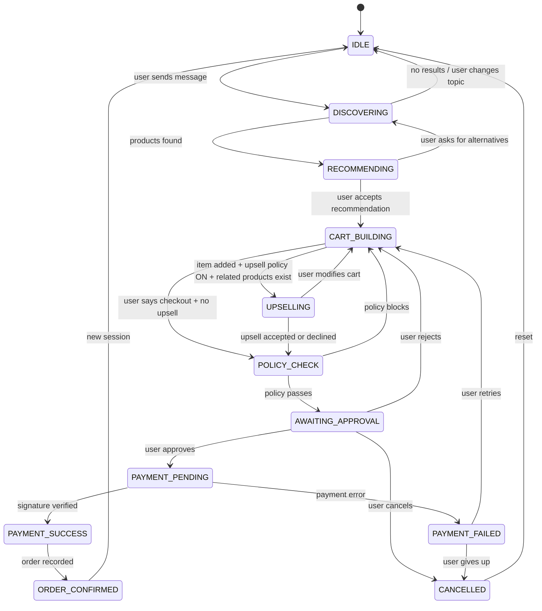

# RazorFlow AI — State Machine

## Session States



## Guard Conditions

| Transition | From → To | Guard Condition |
|------------|-----------|-----------------|
| Start chat | `IDLE → DISCOVERING` | Valid non-empty user message received |
| Products found | `DISCOVERING → RECOMMENDING` | ≥1 product matches search query |
| No results | `DISCOVERING → IDLE` | 0 products match OR user changes topic |
| Accept product | `RECOMMENDING → CART_BUILDING` | User explicitly accepts a product recommendation |
| Want alternatives | `RECOMMENDING → DISCOVERING` | User asks for different options |
| Item added + upsell | `CART_BUILDING → UPSELLING` | Cart has ≥1 item AND `policy.allow_upsell == true` AND related products exist for cart items |
| Initiate checkout | `CART_BUILDING → POLICY_CHECK` | Cart non-empty AND user initiates checkout (or upsell disabled) |
| Upsell resolved | `UPSELLING → POLICY_CHECK` | User accepted or explicitly declined the upsell offer |
| Modify during upsell | `UPSELLING → CART_BUILDING` | User modifies cart contents during upsell |
| Policy passes | `POLICY_CHECK → AWAITING_APPROVAL` | `PolicyEngine.check()` returns `ALLOWED` |
| Policy blocks | `POLICY_CHECK → CART_BUILDING` | `PolicyEngine.check()` returns `BLOCKED` with reason |
| User approves | `AWAITING_APPROVAL → PAYMENT_PENDING` | `Approval.status == 'approved'` set by user action |
| User rejects | `AWAITING_APPROVAL → CART_BUILDING` | `Approval.status == 'rejected'` set by user action |
| User cancels | `AWAITING_APPROVAL → CANCELLED` | User explicitly cancels the entire order |
| Payment success | `PAYMENT_PENDING → PAYMENT_SUCCESS` | `verify_payment_signature()` succeeds |
| Payment fails | `PAYMENT_PENDING → PAYMENT_FAILED` | Payment error OR signature verification failure |
| Order created | `PAYMENT_SUCCESS → ORDER_CONFIRMED` | Order record created with `status='paid'` |
| Retry payment | `PAYMENT_FAILED → CART_BUILDING` | Retry chosen AND `policy.allow_auto_retry` AND retry_count < 3 |
| Give up | `PAYMENT_FAILED → CANCELLED` | User declines retry |
| New session | `ORDER_CONFIRMED → IDLE` | User starts new conversation |
| Reset | `CANCELLED → IDLE` | Automatic reset |

## Invalid Transitions (Rejected with 409)

These transitions are **never** allowed and will be rejected by the backend:

- `PAYMENT_PENDING → ORDER_CONFIRMED` (must go through PAYMENT_SUCCESS first)
- `IDLE → PAYMENT_PENDING` (cannot skip discovery/cart/approval)
- `DISCOVERING → PAYMENT_PENDING` (cannot skip cart/approval)
- `CART_BUILDING → PAYMENT_PENDING` (must go through POLICY_CHECK + APPROVAL)
- `PAYMENT_SUCCESS → CART_BUILDING` (payment already succeeded, cannot go back)
- Any state → `PAYMENT_SUCCESS` except from `PAYMENT_PENDING`

## Implementation

```python
VALID_TRANSITIONS = {
    "IDLE": ["DISCOVERING"],
    "DISCOVERING": ["RECOMMENDING", "IDLE"],
    "RECOMMENDING": ["CART_BUILDING", "DISCOVERING"],
    "CART_BUILDING": ["UPSELLING", "POLICY_CHECK"],
    "UPSELLING": ["POLICY_CHECK", "CART_BUILDING"],
    "POLICY_CHECK": ["AWAITING_APPROVAL", "CART_BUILDING"],
    "AWAITING_APPROVAL": ["PAYMENT_PENDING", "CART_BUILDING", "CANCELLED"],
    "PAYMENT_PENDING": ["PAYMENT_SUCCESS", "PAYMENT_FAILED"],
    "PAYMENT_SUCCESS": ["ORDER_CONFIRMED"],
    "PAYMENT_FAILED": ["CART_BUILDING", "CANCELLED"],
    "ORDER_CONFIRMED": ["IDLE"],
    "CANCELLED": ["IDLE"],
}
```
